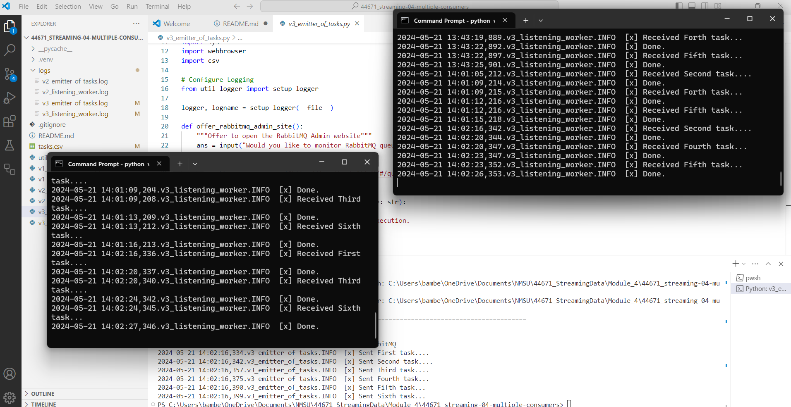

## Bambee Garfield
## CSIS 44671 - Module 4

# streaming-04-multiple-consumers

> Use RabbitMQ to distribute tasks to multiple workers

One process will create task messages. Multiple worker processes will share the work. 

## Before You Begin ✔️

1. Fork this starter repo into your GitHub.
1. Clone your repo down to your machine.
1. View / Command Palette - then Python: Select Interpreter
1. Select your conda environment. 

## Read ✔️

1. Read the [RabbitMQ Tutorial - Work Queues](https://www.rabbitmq.com/tutorials/tutorial-two-python.html)
1. Read the code and comments in this repo.

## RabbitMQ Admin ✔️

RabbitMQ comes with an admin panel. When you run the task emitter, reply y to open it. 

(Python makes it easy to open a web page - see the code to learn how.)

## Execute the Producer ✔️

1. In terminal, run v3_emitter_of_tasks.py (say y to monitor RabbitMQ queues)

## Execute a Consumer / Worker ✔️

1. In two separate terminals, run v3_listening_worker.py

You should see the two terminals alternating tasks: 1, 3, 5 on one and 2, 4, 6 on the other.

Will it terminate on its own? How do you know? It will not. You know this because this is the first line you see when it starts running:  [*] Ready for work. To exit press CTRL+C. 

## Ready for Work

1. Use your emitter_of_tasks to produce more task messages.

## Start Another Listening Worker 

1. Use your listening_worker.py script to launch a second worker. 

Follow the tutorial. 
Add multiple tasks (e.g. First message, Second message, etc.)
How are tasks distributed? The first three have 4 .... and alternate. Then the next two go to one because they take less time, and 6 goes back to the first.
Monitor the windows with at least two workers. 
Which worker gets which tasks?

## Reference

- [RabbitMQ Tutorial - Work Queues](https://www.rabbitmq.com/tutorials/tutorial-two-python.html)

## Screenshot

See a running example with at least 3 concurrent process windows here:
